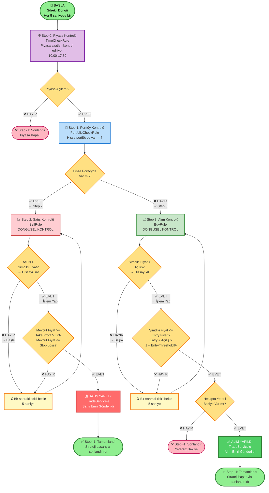

# Strateji Akış Diyagramı (Flowchart)

## Mevcut Strateji Akışı - Görsel Tasarım



## Detaylı Adım Açıklamaları

### 🚀 BAŞLA
- **Worker Service** tarafından sürekli çalıştırılır
- Her **5 saniyede bir** aktif stratejiler kontrol edilir
- MarketDataService'den güncel fiyat bilgileri alınır

### ⏰ Step 0: Piyasa Kontrolü (TimeCheckRule)
- **Kural:** Piyasa saatleri kontrolü
- **Koşul:** `Now.TimeOfDay >= 10:00 && <= 17:59`
- **Kontrol:** `ctx.MarketOpen`
- **✅ EVET →** Step 1 (Portföy Kontrolü)
- **❌ HAYIR →** Step -1 (Piyasa Kapalı - Sonlandır)
- **Döngüsel:** Her 5 saniyede bir kontrol edilir

### 💼 Step 1: Portföy Kontrolü (PortfolioCheckRule)
- **Kural:** Hisse senedi portföyde var mı?
- **Servis:** `PortfolioService(PortfolioId, Symbol)` çağrılır
- **Kontrol:** `ctx.InPortfolio`
- **✅ EVET →** Step 2 (Satış Kontrolü - Sol Dal)
- **❌ HAYIR →** Step 3 (Alım Kontrolü - Sağ Dal)

### 📉 Step 2: Satış Kontrolü (SellRule) - DÖNGÜSEL
**Kontrol 1:** `Açılış Fiyatı > Şimdiki Fiyat` (Finnhub verisi)
- **✅ EVET →** İşlem Yap dalına geç
- **❌ HAYIR →** Başla (Döngüye dön, 5 saniye bekle)

**Kontrol 2:** Satış koşulları
- `Mevcut Fiyat >= Take Profit Fiyatı` VEYA
- `Mevcut Fiyat <= Stop Loss Fiyatı`
- **Take Profit:** `BuyPrice × (1 + TakeProfitPercent / 100)`
- **Stop Loss:** `BuyPrice × (1 - StopLossPercent / 100)`
- **✅ EVET →** Satış yap → Step -1
- **❌ HAYIR →** Döngüye dön (5 saniye bekle, tekrar kontrol)

### 📈 Step 3: Alım Kontrolü (BuyRule) - DÖNGÜSEL
**Kontrol 1:** `Şimdiki Fiyat < Açılış Fiyatı` (Finnhub verisi)
- **✅ EVET →** İşlem Yap dalına geç
- **❌ HAYIR →** Başla (Döngüye dön, 5 saniye bekle)

**Kontrol 2:** Entry Threshold kontrolü
- `Şimdiki Fiyat <= Entry Fiyatı`
- Entry Fiyatı = `Açılış Fiyatı × (1 + EntryThresholdPercent / 100)`
- EntryThresholdPercent genellikle negatif (örn: -5% = açılışın %5 altı)
- **✅ EVET →** Bakiye kontrolüne geç
- **❌ HAYIR →** Döngüye dön (5 saniye bekle, tekrar kontrol)

**Kontrol 3:** Bakiye kontrolü
- Gerekli: `TransactionAmount`
- Kontrol: `AccountService(AccountId) >= TransactionAmount`
- **✅ EVET →** Alım yap → Step -1
- **❌ HAYIR →** Step -1 (Yetersiz Bakiye - Sonlandır)

### ✅ Step -1: Tamamlandı
- Strateji başarıyla sonlandırıldı
- İşlem yapıldı (Alım veya Satış) veya piyasa kapalı/yetersiz bakiye nedeniyle sonlandı

## Döngüsel Kontrol Mekanizması

**Step 2 ve Step 3** döngüsel adımlardır:
- Her 5 saniyede bir Worker Service tarafından kontrol edilir
- Koşullar sağlanana kadar aynı step'te kalır
- Koşullar sağlandığında işlem yapılır ve Step -1'e geçilir
- **"Döngüye Dön"** okları ile gösterilir

## Finnhub Verileri Kullanımı

Strateji kuralları Finnhub'dan gelen gerçek zamanlı verileri kullanır:

| Veri | Açıklama | Kullanım |
|------|----------|----------|
| **CurrentPrice** | Güncel fiyat | Tüm karar noktalarında |
| **OpeningPrice** | Günün açılış fiyatı | Entry ve satış kararlarında |
| **HighPrice** | Günün yüksek fiyatı | Analiz için |
| **LowPrice** | Günün düşük fiyatı | Analiz için |
| **PreviousClosePrice** | Önceki kapanış | Karşılaştırma için |
| **Change & PercentChange** | Fiyat değişimi | Trend analizi |

## Kullanıcı Tanımlı Parametreler

| Parametre | Açıklama | Varsayılan | Örnek |
|-----------|----------|------------|-------|
| **EntryThresholdPercent** | Alım için entry threshold | -5% | Açılışın %5 altına düşerse al |
| **TakeProfitPercentage** | Kar alma yüzdesi | 5% | %5 kar yapınca sat |
| **StopLossPercentage** | Zarar durdurma yüzdesi | 2% | %2 zarar olunca sat |
| **MaxLossLimitPercentage** | Maksimum toplam zarar limiti | 5% | Toplam %5 zarar olunca durdur |
| **TransactionAmount** | İşlem tutarı (TL) | - | 1000 TL |
| **DurationHours** | Strateji geçerlilik süresi | - | 24 saat |

## Worker Service Döngüsü

```
1. Aktif stratejileri yükle
   ↓
2. Her strateji için:
   - MarketDataService'den güncel fiyat bilgilerini al
   - NRules session'ı oluştur/güncelle
   - Kuralları çalıştır
   - Step değişikliklerini kaydet
   ↓
3. 5 saniye bekle
   ↓
4. Tekrar başla (1. adıma dön)
```

## Karar Noktaları Özeti

### Piyasa Kontrolü (Step 0)
- **EVET:** Piyasa açık → Portföy kontrolüne geç
- **HAYIR:** Piyasa kapalı → Stratejiyi sonlandır

### Portföy Kontrolü (Step 1)
- **EVET:** Hisse portföyde var → Satış kontrolüne geç (Step 2)
- **HAYIR:** Hisse portföyde yok → Alım kontrolüne geç (Step 3)

### Satış Kontrolü (Step 2)
- **Açılış > Şimdiki Fiyat?**
  - **EVET:** Take Profit/Stop Loss kontrolüne geç
  - **HAYIR:** Döngüye dön (5 saniye bekle)
- **Take Profit/Stop Loss?**
  - **EVET:** Satış yap → Tamamlandı
  - **HAYIR:** Döngüye dön (5 saniye bekle)

### Alım Kontrolü (Step 3)
- **Şimdiki Fiyat < Açılış?**
  - **EVET:** Entry threshold kontrolüne geç
  - **HAYIR:** Döngüye dön (5 saniye bekle)
- **Şimdiki Fiyat <= Entry Fiyatı?**
  - **EVET:** Bakiye kontrolüne geç
  - **HAYIR:** Döngüye dön (5 saniye bekle)
- **Yeterli Bakiye?**
  - **EVET:** Alım yap → Tamamlandı
  - **HAYIR:** Stratejiyi sonlandır (Yetersiz Bakiye)
