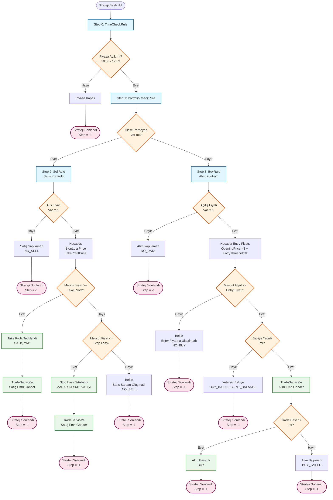
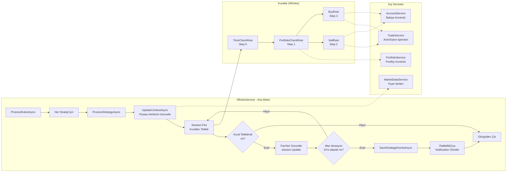
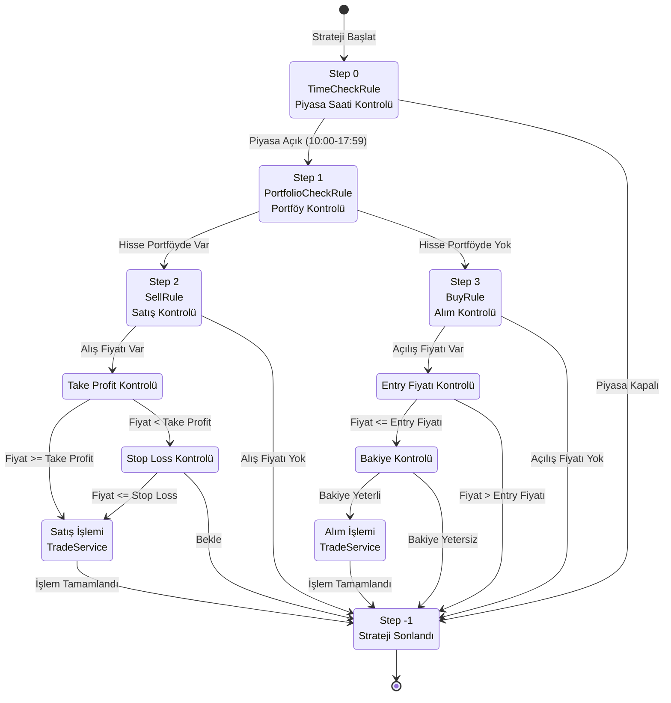
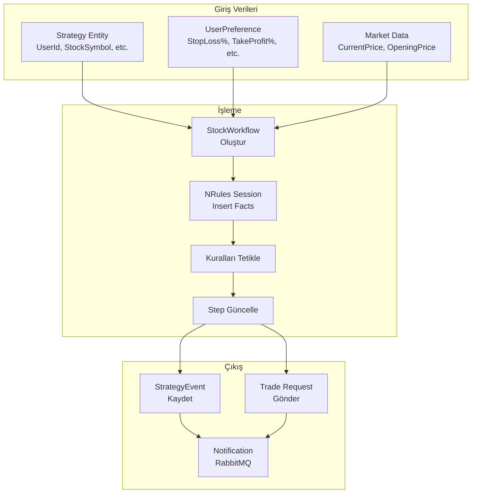
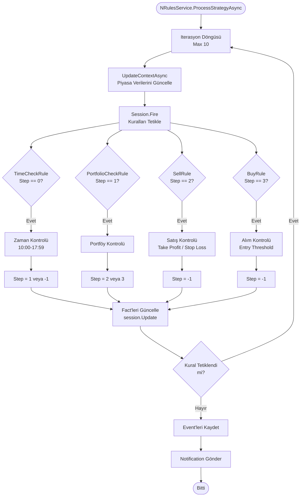

# Strategy Algoritması Flowchart

## Ana Akış Diyagramı

## Detaylı Kural Akış Diyagramı

## Step Bazlı Detaylı Akış

## Veri Akış Diyagramı

## Kural Tetikleme Mantığı

## Özet Tablo

| Step | Kural | Koşul | Aksiyon | Sonraki Step |
|------|-------|-------|---------|--------------|
| 0 | TimeCheckRule | Piyasa açık mı? (10:00-17:59) | Evet → Step 1 Hayır → Step -1 | 1 veya -1 |
| 1 | PortfolioCheckRule | Hisse portföyde var mı? | Evet → Step 2 Hayır → Step 3 | 2 veya 3 |
| 2 | SellRule | Take Profit veya Stop Loss? | Take Profit → SAT Stop Loss → SAT Yok → Bekle | -1 |
| 3 | BuyRule | Entry fiyatına ulaşıldı mı? | Evet + Bakiye yeterli → AL Hayır → Bekle | -1 |
| -1 | - | - | Strateji sonlandı | - |

